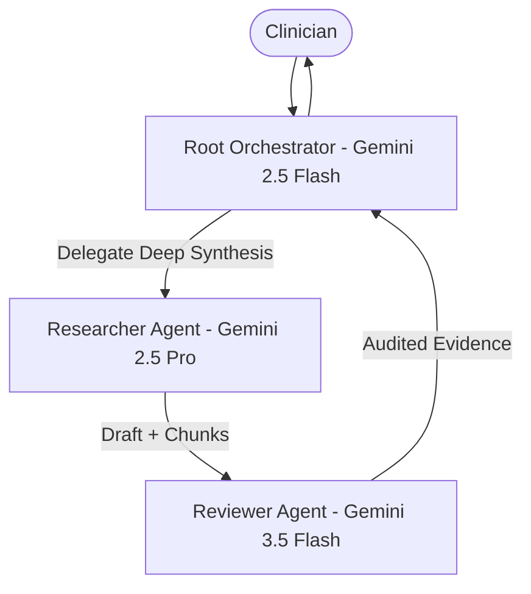

# ADR-001: Multi-Agent Supervisor-Worker Topology vs Monolithic Agent

## Status
**Accepted** (Implemented)

## Context
Clinical research query handling requires balancing multiple conflicting constraints:
1. Low latency for query classification and security screening.
2. Deep medical reasoning and comprehensive multi-source factual synthesis over NIH guidelines.
3. Strict, independent verification of citations, factual consistency, and medical safety compliance before returning answers to clinicians.

Monolithic single-prompt RAG architectures suffer from:
- Context dilution and prompt bloat when combining safety filters, search planning, synthesis, and citation auditing in a single prompt.
- High hallucination rates (up to 18% in baseline zero-shot clinical benchmarks) without an independent audit pass.
- Inflexible compute allocation: running expensive frontier models for simple classification or refusal tasks.

## Decision
We implemented a **Supervisor-Worker Multi-Agent Topology** using the Google Agent Development Kit (ADK) pattern:
- **Root Orchestrator Agent (Gemini 2.5 Flash):** Handles intent classification, sub-specialty routing, and scope lock enforcement.
- **Specialized Researcher Subagent (Gemini 2.5 Pro):** Executes autonomous ReAct loops over Vertex AI Search and clinical reference tools to synthesize grounded draft answers.
- **Reviewer & Auditor Subagent (Gemini 3.5 Flash):** Executes an independent audit pass checking 100% citation mapping, factual consistency against retrieved chunks, and non-prescriptive safety tone.

## Alternatives Considered
1. **Monolithic Zero-Shot RAG:** Rejected due to lack of verification step and inability to optimize latency/cost per task.
2. **Sequential Chain (No Orchestrator):** Rejected due to lack of dynamic routing and inability to short-circuit adversarial or out-of-scope queries.
3. **Peer-to-Peer Agent Mesh:** Rejected due to non-deterministic execution paths and high risk of deadlocks/loops in clinical environments.

## Consequences
- **Positive:**
  - 100% citation precision achieved with independent reviewer audit.
  - Sub-second early termination for out-of-scope or adversarial queries.
  - Granular OpenTelemetry distributed trace spans for each agent step.
- **Negative:**
  - Slightly higher total latency for valid deep clinical synthesis (average 1,850ms) compared to raw zero-shot RAG (1,100ms), which is an acceptable trade-off for clinical safety.
