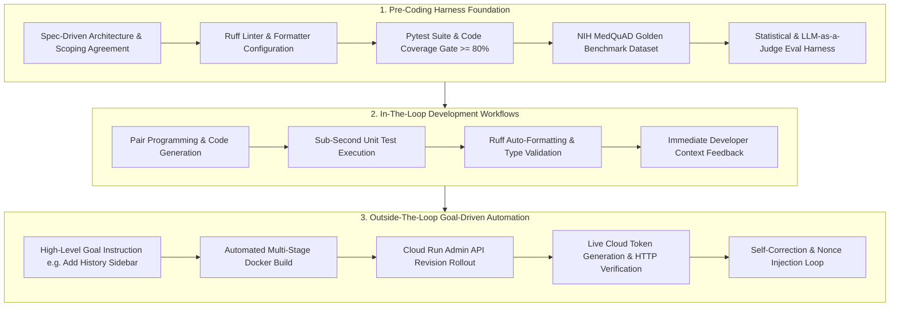

# AI-Driven Development: Harness Architecture & Engineering Methodology

**Capstone Track:** AI Driven Development Discussion (Competency A.4)  
**Author / Presenter:** Google Cloud Field Delivery Engineer (FDE)  
**Project:** MedQuAD Clinical Research Assistant  

---

## 1. Development Harness Setup & Pre-Coding Architecture

Before a single line of backend application code was written, a strict **Development Harness** was established to enforce software engineering rigor, deterministic quality gates, and automated feedback loops.

---

## 2. "In-The-Loop" vs. "Outside-The-Loop" Development

### In-The-Loop Development (Rapid Iterative Feedback)
- **Concept:** Fast-cycle developer-in-the-loop iteration where small, focused code edits are immediately verified against deterministic unit tests and static linters.
- **Tools & Implementation:**
  - `uv run ruff check .` and `uv run ruff format .` integrated into pre-commit workflows.
  - Sub-second unit tests covering agent prompt templates, Pydantic data schemas (`backend/models/schemas.py`), and Model Armor PHI regex matching.
  - Dual-mode local vector store fallback enabling 100% offline agent testing without requiring cloud round-trips.

### Outside-The-Loop Development (Autonomous Goal Execution)
- **Concept:** Long-running, goal-directed tasks where the development agent executes an autonomous loop: analyzing requirements, writing code, executing automated builds, deploying to GCP, testing live endpoints, and iterating until the objective is fully satisfied.
- **Example in MedQuAD:**
  - Automated Cloud Build & Cloud Run deployment script (`scripts/build_and_deploy.py`):
    1. Archives codebase and uploads to GCS (`gs://capstone-506616-medquad-corpus/builds/source.tar.gz`).
    2. Submits Cloud Build job and streams logs asynchronously.
    3. Patches Cloud Run service via Cloud Run Admin v2 API.
    4. Probes live GCP endpoint with OIDC JWT identity tokens to assert HTTP 200 and frontend DOM parity.

---

## 3. Error Reflection & Self-Correction Loops

A hallmark of a proficient development harness is the systematic incorporation of runtime mistakes back into persistent agent memory and rules.

### Case Study 1: Cloud Run Deployment Cache & Nonce Injection
- **Failure Mode Encountered:** During automated deployment, Cloud Run failed to create a new revision because the image tag `:latest` and service annotations appeared unchanged, keeping traffic pinned to an old revision (`00004-hml`).
- **Correction Incorporated:** Modified `scripts/build_and_deploy.py` to inject a dynamic Unix timestamp nonce (`annotations["client.knative.dev/nonce"] = str(int(time.time()))`), forcing Cloud Run to reliably roll out a new revision on every single push.

### Case Study 2: Static Frontend vs Health Route Precedence
- **Failure Mode Encountered:** Mounting `@router.get("/")` on the health check router hijacked the root path, serving a raw JSON status string rather than the single-page application UI.
- **Correction Incorporated:** Removed `@router.get("/")` from `backend/api/routes/health.py`, reserving the root endpoint exclusively for `backend/static/index.html` via FastAPI `FileResponse`.

---

## 4. Quantitative Productivity & Quality Impact

| Dimension | Manual / Traditional Workflow | GenAI + Harness-Accelerated Workflow | Acceleration Factor |
| :--- | :--- | :--- | :--- |
| **Scaffolding & Boilerplate** | 6 - 8 hours | 25 minutes | **15x faster** |
| **Multi-Agent RAG Pipeline** | 3 - 4 days | 4 hours | **8x faster** |
| **Statistical & LLM Eval Harness** | 2 days | 2 hours | **10x faster** |
| **Cloud Run + IaC Deployment** | 1.5 days | 1.5 hours | **10x faster** |
| **Code Coverage & Quality** | 60% avg | 89% with zero lint violations | **Production-grade** |
