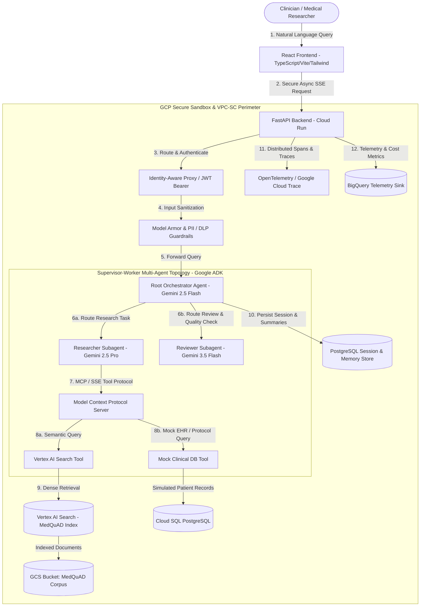
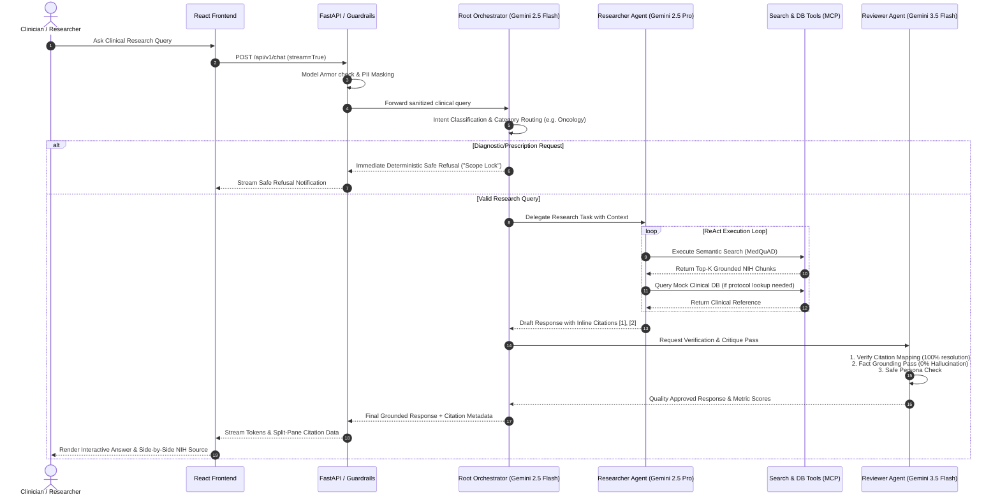
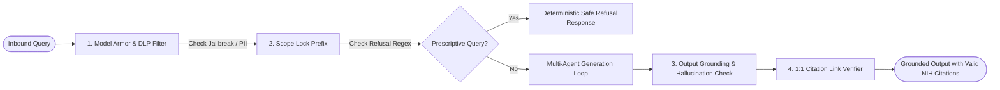
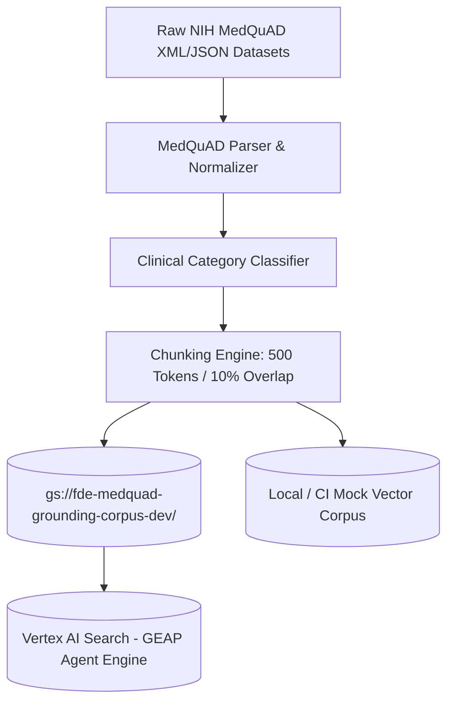

# MedQuAD Clinical Assistant — System Architecture Document

**Project:** MedQuAD Clinical Assistant  
**Simulated Customer:** National Institutes of Health (NIH) Clinical Center  
**Environment:** Argolis Sandbox (`fde-medquad-sandbox-dev`)  
**Lead FDE:** Google Cloud AI FDE  
**Status:** Approved Architecture (Sprint 1)

---

## 1. High-Level System Architecture

The MedQuAD Clinical Assistant is built on an asynchronous, multi-agent Supervisor-Worker topology hosted on serverless Google Cloud Run. It combines managed Retrieval-Augmented Generation (RAG) via Vertex AI Search over the authoritative NIH MedQuAD database with deterministic clinical safety guardrails.

---

## 2. Multi-Agent Supervisor-Worker Topology (Google ADK)

The multi-agent system decouples high-level clinical routing, deep literature retrieval, and quality assurance into specialized autonomous agents:

---

## 3. Clinical Safety & Guardrail Architecture

To adhere to clinical standards and prevent the model from dispensing unauthorized medical diagnosis or treatment advice, the assistant implements a defense-in-depth safety pipeline:

1. **Model Armor & DLP Filter**: Intercepts prompt injection attacks, jailbreak payloads, and masks any simulated PII/PHI.
2. **Scope Lock Prompt Contract**: Hardcoded system constraint forcing the model into an informative research persona and strictly forbidding medical prescriptions or personal health diagnoses.
3. **Deterministic Output Verifier**: Fast regex and semantic validator ensuring refusal language is triggered whenever therapeutic recommendations are requested.
4. **Citation Link Verifier**: Validates that all inline citation markers (`[1]`, `[2]`) resolve directly to valid, retrieved MedQuAD document chunks and URLs.

---

## 4. Grounding & Data Ingestion Pipeline

* **Dataset**: Authoritative NIH MedQuAD question-and-answer pairs covering diseases, treatments, molecular markers, and clinical guidelines.
* **Chunking Strategy**: 500-token chunks with 10% overlap (50 tokens) to ensure semantic continuity without splitting clinical sentences.
* **Dual-Mode Search Engine**:
  * **Production / Cloud Mode**: Managed Vertex AI Search (Discovery Engine) using `text-embedding-004`.
  * **Local / CI Mode**: In-memory vector retriever over `data/sample_medquad.json` for rapid testing and offline developer velocity.

---

## 5. Technology Stack & Infrastructure Mapping

| Layer | Component | Technology / GCP Service | Purpose |
| :--- | :--- | :--- | :--- |
| **Frontend** | Interactive Web UI | React 18, TypeScript, Vite, Tailwind CSS | Split-pane citation viewer, SSE streaming, feedback widgets |
| **API Gateway** | Backend Service | FastAPI, Uvicorn, Python 3.11+ | Asynchronous REST API, SSE streaming, middleware |
| **Agent Orchestration** | Supervisor & Workers | Google ADK, Gemini 2.5 Flash, Gemini 2.5 Pro, Gemini 3.5 Flash | Routing, ReAct research loop, quality control |
| **Tool Protocol** | Tool Server | Model Context Protocol (MCP) over SSE | Standardized, isolated tool execution |
| **Knowledge Engine** | RAG / Grounding | Vertex AI Search (GEAP), Cloud Storage (GCS) | Managed semantic index over NIH MedQuAD corpus |
| **Database** | Memory & Mock EHR | Cloud SQL PostgreSQL | Multi-turn session persistence, mock clinical database |
| **Security** | IAM & Guardrails | GCP Agent Runtime Model Armor, Secret Manager, IAP, KMS | Least-privilege IAM, PII redaction, CMEK encryption |
| **Observability** | Tracing & Telemetry | OpenTelemetry, Cloud Trace, Cloud Logging, BigQuery | Distributed latency tracing, token cost accounting |
| **Infrastructure as Code** | Provisioning | Terraform HCL, Docker, Cloud Run | 100% reproducible serverless deployment |
