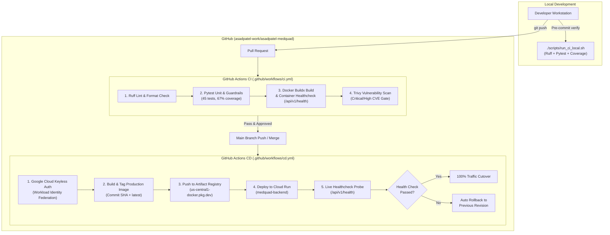

# MedQuAD CI/CD & Deployment Pipeline

This document outlines the Continuous Integration (CI) and Continuous Deployment (CD) architecture for the **MedQuAD Multi-Agent Clinical Research Platform**.

---

## 1. Pipeline Architecture



---

## 2. CI Pipeline (`.github/workflows/ci.yml`)

The CI workflow automatically triggers on every **Pull Request** and **Push to feature branches**. It enforces quality gates before any code merges to `main`:

1. **Linting & Code Formatting (Ruff)**:
   * Enforces Python 3.11 standards, import sorting, and code formatting rules.
   * Command: `ruff check backend/ tests/ && ruff format --check backend/ tests/`.
2. **Unit & Guardrail Test Suite (Pytest)**:
   * Executes all 45 automated unit and clinical guardrail tests:
     * **Agent Flow**: Root Orchestrator intent classification and delegation loop bounds (`max_iterations=2`).
     * **Safe Refusal Engine**: Deterministic <5ms boundary refusal on personal diagnosis / dosage.
     * **Model Armor**: HIPAA Safe Harbor 18 PHI identifier masking and jailbreak mitigation.
     * **CitationVerifier**: Strict 1:1 chunk ID matching.
     * **Resilience**: In-memory vector database fallback on simulated Vertex 504 timeouts.
   * Generates coverage XML and uploads build artifacts.
3. **Container Build & Live Boot Validation**:
   * Uses Docker Buildx with GitHub Actions layer caching.
   * Spins up an ephemeral container instance and probes `http://localhost:8000/api/v1/health`.
   * Guarantees that container configuration errors or broken entrypoints fail in CI before reaching production.
4. **Vulnerability Scanning (Trivy)**:
   * Inspects OS packages and Python dependencies for `CRITICAL` or `HIGH` vulnerabilities.

---

## 3. CD Pipeline (`.github/workflows/cd.yml`)

The CD workflow triggers upon **merging into `main`** or via manual `workflow_dispatch`.

### Key Features
* **Keyless Workload Identity Federation (WIF)**: Uses short-lived Google Cloud OIDC tokens rather than long-lived JSON service account keys.
* **Deterministic Tagging**: Images are tagged immutably with the Git commit SHA (`sha-<commit_sha>`) and `:latest`.
* **Zero-Downtime Rollout**: Google Cloud Run provisions a new revision, verifies its startup probe, and shifts traffic seamlessly.
* **Automated Smoke Test**: Probes the Cloud Run service URL `/api/v1/health` with retry backoff.
* **Automated Rollback**: If the new revision fails to boot or returns non-200 responses, the pipeline instantly reverts 100% of traffic to the previous healthy revision using `gcloud run services update-traffic`.

---

## 4. Workload Identity Federation (WIF) Setup

To connect GitHub Actions to Google Cloud without storing private keys:

Run the automated provisioning script on your workstation:
```bash
./scripts/setup_github_wif.sh asadpatel-work/asadpatel-medquad
```

This script automatically:
1. Creates `sa-github-actions@capstone-506616.iam.gserviceaccount.com`.
2. Grants IAM permissions:
   * `roles/artifactregistry.writer`
   * `roles/run.developer`
   * `roles/iam.serviceAccountUser` (for the runtime service account `sa-medquad-runtime`).
3. Provisions the Workload Identity Pool `github-actions-pool` and Provider `github-actions-provider`.
4. Restricts token exchange strictly to repository `asadpatel-work/asadpatel-medquad`.

### GitHub Secrets Reference
Configure these secrets under **Settings > Secrets and variables > Actions**:

| Secret Name | Value Example | Description |
|---|---|---|
| `GCP_WIF_PROVIDER` | `projects/1055109340350/locations/global/workloadIdentityPools/github-actions-pool/providers/github-actions-provider` | Full OIDC provider resource path |
| `GCP_WIF_SERVICE_ACCOUNT` | `sa-github-actions@capstone-506616.iam.gserviceaccount.com` | Service account for CI/CD |
| `GCP_SA_KEY` *(Optional)* | `{"type": "service_account", ...}` | Optional fallback JSON key if WIF is not used |

---

## 5. Google Cloud Build Alternative (`cloudbuild.yaml`)

For teams running deployments natively within Google Cloud or using Google Cloud Build Triggers:

```bash
# Submit build, test, and deploy directly to Cloud Build
gcloud builds submit --config=cloudbuild.yaml .
```

* **Step 1**: Runs Ruff and Pytest inside a `python:3.11-slim` container.
* **Step 2**: Builds Docker container with registry caching.
* **Step 3**: Pushes tags to Artifact Registry `us-central1-docker.pkg.dev/capstone-506616/medquad/medquad-backend`.
* **Step 4**: Deploys revision to Cloud Run `medquad-backend`.
* **Step 5**: Verifies `/api/v1/health`.

---

## 6. Local Developer Pre-Flight (`scripts/run_ci_local.sh`)

Engineers should verify changes locally before pushing:

```bash
# Fast local test (Ruff lint + format + Pytest with coverage)
./scripts/run_ci_local.sh

# Complete local test including Docker build and healthcheck boot
./scripts/run_ci_local.sh --with-docker
```
