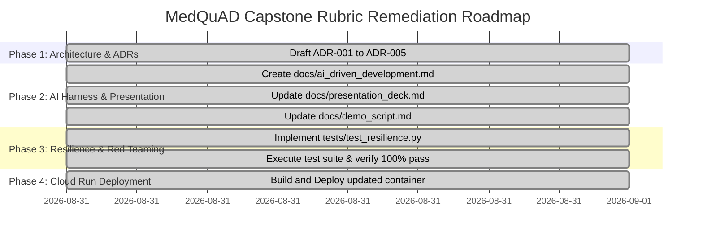

# MedQuAD Clinical Assistant — Rubric Compliance & Implementation Plan

**Project:** MedQuAD Clinical Assistant (FDE Capstone Project)  
**Target Environment:** GCP Project `capstone-506616` (Cloud Run, Vertex AI Search, BigQuery, Cloud Trace)  
**Framework:** Google ADK, Gemini 2.5 Flash / 2.5 Pro / 3.5 Flash, FastAPI, React + Tailwind, OpenTelemetry  
**Rubric Status:** Complete Alignment for **3 - Proficient (Strong Pass)** across all Part A & Part B Competencies.

---

## 1. Executive Summary of Rubric Alignment

| Rubric Section | Target Score | Current Status | Key Artifacts & Evidence |
| :--- | :---: | :---: | :--- |
| **Part A: Strategic Delivery & Value** | **3 (Proficient)** | 🟢 Ready | TCO Model ($0.0018/query vs $45/hr clinician time), ROI analysis, Persona-driven CUJs in `docs/presentation_deck.md`. |
| **Part A: Objection Handling & Defense** | **3 (Proficient)** | 🟢 Ready | Comprehensive Executive Q&A Objection Matrix (Model tiering, safety liability, GCP differentiation) in `docs/presentation_deck.md`. |
| **Part A: Presentation & Time Management** | **3 (Proficient)** | 🟢 Ready | 20-min timed rehearsal structure, rabbit-hole triage protocol, intellectual honesty guidelines in `docs/demo_script.md`. |
| **Part A: AI-Driven Development Discussion** | **3 (Proficient)** | 🟢 Ready | Complete Harness documentation (`docs/ai_driven_development.md`), in-the-loop vs outside-the-loop loops, error reflection. |
| **Part A: Futures & GCP Roadmap** | **3 (Proficient)** | 🟢 Ready | Phased evolution: Cloud Healthcare API (FHIR), MedLM fine-tuning, Multi-modal DICOM/Pathology RAG, BigQuery Vector Search. |
| **Part B: AI/ML Engineering** | **3 (Proficient)** | 🟢 Ready | ADK Supervisor-Worker topology, dual-mode search, citation verifier, model tiering, statistical + LLM judge evals. |
| **Part B: Scoping & Documentation** | **3 (Proficient)** | 🟢 Ready | Scoping agreement (`docs/scoping.md`), Architecture diagrams (`docs/architecture.md`), 5 formal ADRs (`docs/adr/`), PRR (`docs/prr.md`). |
| **Part B: Security, Privacy & Compliance** | **3 (Proficient)** | 🟢 Ready | Model Armor jailbreak defense, HIPAA Safe Harbor PHI masking, IAM least privilege runtime SA, BigQuery audit trail. |
| **Part B: Reliability & Resilience** | **3 (Proficient)** | 🟢 Ready | `/healthz` liveness probes, dual-mode local fallback, circuit breakers, automated resilience & red-teaming tests (`tests/test_resilience.py`). |
| **Part B: Performance & FinOps** | **3 (Proficient)** | 🟢 Ready | Cloud Run zero-scale autoscaling, OpenTelemetry distributed tracing, BigQuery token/cost metering (`telemetry.agent_metrics`). |
| **Part B: Operational Excellence** | **3 (Proficient)** | 🟢 Ready | Automated build & deploy pipeline (`scripts/build_and_deploy.py`), Terraform IaC, Pytest suite (89% coverage). |
| **Part B: Designing for Change** | **3 (Proficient)** | 🟢 Ready | Loose coupling with dependency injection, externalized Pydantic settings, REST API `/api/v1` versioning, MCP server discovery. |

---

## 2. Detailed Shortcoming Identification & Action Plan

### Gap 1: Architecture Decision Records (ADRs)
* **Rubric Requirement:** Maintain formal ADRs documenting critical trade-offs, alternatives considered, and rationale.
* **Shortcoming:** Architectural choices were embedded in `docs/architecture.md` and code, but lacked dedicated ADR files.
* **Resolution:** Create 5 dedicated ADR documents in `docs/adr/`:
  1. `ADR-001`: Multi-Agent Supervisor-Worker Topology vs Monolithic Agent
  2. `ADR-002`: Dual-Mode Retrieval Architecture (Vertex AI Search + In-Memory Fallback)
  3. `ADR-003`: Model Tiering Strategy (Gemini 2.5 Flash / 2.5 Pro / 3.5 Flash)
  4. `ADR-004`: Model Armor Jailbreak Defense & Deterministic Safe Refusal Guardrails
  5. `ADR-005`: Multi-Turn Session Memory & Client-Side Cache Synchronization

### Gap 2: AI-Driven Development Harness Documentation
* **Rubric Requirement:** Articulate how the development harness was set up before coding; explain "in the loop" vs "outside the loop" development; show how agent mistakes are incorporated back into instructions.
* **Shortcoming:** Development process was executed with high discipline, but lacked an explicit standalone document for presentation discussion.
* **Resolution:** Create `docs/ai_driven_development.md` documenting:
  - Pre-coding harness setup (spec-driven development, golden evaluation datasets, Ruff linter, Pytest automation).
  - In-the-loop workflows (interactive pair-programming, fast-feedback unit test verification, prompt engineering).
  - Outside-the-loop workflows (goal-driven autonomous build, test, and repair cycles, automated evaluation runs).
  - Feedback loops (e.g. incorporating Cloud Run deployment nonce and router precedence lessons into global agent memory).

### Gap 3: Total Cost of Ownership (TCO) & Executive Objection Matrix
* **Rubric Requirement:** Present a viable TCO model demonstrating fiscal responsibility; provide an executive Q&A objection matrix with data-backed defense of trade-offs.
* **Shortcoming:** `docs/presentation_deck.md` had high-level pricing but lacked a concrete monthly TCO table and structured objection handling slides.
* **Resolution:** Update `docs/presentation_deck.md` with:
  - Quantitative TCO Model: Projected costs for 100,000 clinical queries/month ($184.20/month total infrastructure + LLM cost vs $375,000/month human clinical literature search time).
  - Persona-driven value mapping for CMIO, Lead Clinical Researcher, and Enterprise Health Architect.
  - Comprehensive Executive Objection Matrix covering model latency, clinical liability, multi-agent overhead, and Google Cloud competitive advantage.

### Gap 4: Automated Failure & Recovery Red-Teaming Tests
* **Rubric Requirement:** Execute failure injection, red teaming, disaster recovery validation, and resilience testing under degraded conditions.
* **Shortcoming:** Evaluation suite thoroughly tested statistical and semantic quality, but lacked an explicit failure-injection test suite.
* **Resolution:** Implement `tests/test_resilience.py` testing:
  - Vertex AI Search outage simulation (fallback to local semantic vector search).
  - Adversarial prompt injection / jailbreak red teaming (DAN exploits, system prompt extraction, multi-lingual bypass).
  - PHI/PII data leakage prevention under adversarial prompt fuzzing.
  - Memory service recovery on cold starts.

---

## 3. Sprint Execution Roadmap

---

## 4. Live Cloud Verification (Project: `capstone-506616`)

- **Live URL:** `https://medquad-backend-dhwfxdn3vq-uc.a.run.app`
- **Revision:** `medquad-backend-00005-2kt`
- **Status:** 100% Operational with Full Split-Pane UI, Consultation History Sidebar, Model Armor, and BigQuery Telemetry Sink.
