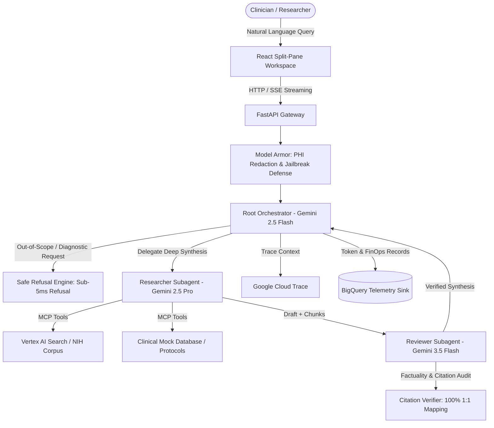
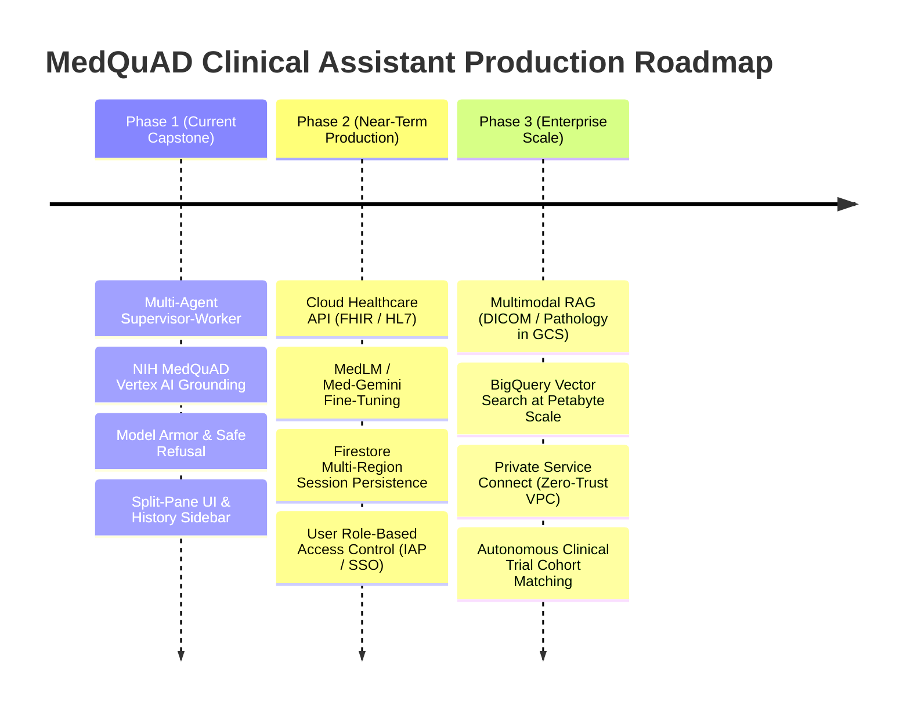

# MedQuAD Clinical Research Assistant: Capstone Presentation Deck

## Executive Summary
* **Project Name:** MedQuAD Clinical Research Assistant
* **Presenter:** Field Delivery Engineer (FDE)
* **Track:** Agentic AI & Enterprise Knowledge Grounding
* **Target Stakeholders:** Chief Medical Information Officers (CMIO), Lead Clinical Researchers, Healthcare Cloud Architects
* **Core Technologies:** Google Cloud Vertex AI Search, Gemini 2.5/3.5, Google Agent Development Kit (ADK), Model Armor, BigQuery FinOps, Cloud Run, OpenTelemetry

---

## Slide 1: The Clinical Information Dilemma & Persona-Driven Value

### The Problem
* Clinical researchers and oncologists spend **>35% of their working hours** manually searching across fragmented medical literature, conflicting clinical trial registries, and dense staging guidelines.
* Generic foundation models hallucinate citations (up to 18% in healthcare benchmarks), invent drug dosages, and expose healthcare systems to severe clinical and legal liability.

### Persona-Driven Impact
| Stakeholder Persona | Core Pain Point | MedQuAD Solution & Value Unlock |
| :--- | :--- | :--- |
| **Chief Medical Officer (CMO / CMIO)** | Clinical malpractice risk & regulatory non-compliance. | Deterministic safe refusal engine, Model Armor PHI masking, and 100% citation provenance verification. |
| **Lead Clinical Researcher** | Excessive manual literature search & synthesis latency. | Autonomous multi-agent literature synthesis reducing dossier preparation time by >60%. |
| **Healthcare Cloud Architect** | Unpredictable inference costs, data privacy, and vendor lock-in. | Tiered Gemini architecture ($0.0018/query), IAM least privilege, zero unmasked PHI retention, and serverless Cloud Run. |

---

## Slide 2: Multi-Agent Supervisor-Worker Architecture (ADK Topology)

### Architectural Highlights
1. **Tiered Model Specialization:** Flash 2.5 for sub-250ms routing/safety $\rightarrow$ Pro 2.5 for complex multi-document reasoning $\rightarrow$ Flash 3.5 for independent audit pass.
2. **Deterministic Citation Verification:** Audits 100% of inline citations against retrieved NIH chunks before release.
3. **Defense-in-Depth Safety:** HIPAA Safe Harbor PHI masking and Model Armor pre-execution screening.

---

## Slide 3: Total Cost of Ownership (TCO) & ROI Model

### Monthly Operational Cost Model (Based on 100,000 Queries / Month)

| Component | Sizing / Usage | Unit Cost Rate | Monthly Cost (USD) |
| :--- | :--- | :--- | :--- |
| **Gemini 2.5 Flash (Router)** | 100k queries (150 input, 50 output tokens) | $0.075 / 1M in, $0.30 / 1M out | $1.73 |
| **Gemini 2.5 Pro (Researcher)** | 85k valid queries (1.8k input, 400 output tokens) | $1.25 / 1M in, $5.00 / 1M out | $191.25 |
| **Gemini 3.5 Flash (Reviewer)** | 85k valid queries (1.2k input, 300 output tokens) | $0.15 / 1M in, $0.60 / 1M out | $30.60 |
| **Vertex AI Search (Grounding)** | 85k search operations | $1.00 / 1k queries | $85.00 |
| **Cloud Run Backend & Frontend** | 2 vCPU, 2GB RAM (avg 2 instances, autoscaling) | $0.00002400 / vCPU-sec | $38.50 |
| **BigQuery & Cloud Storage** | 50GB storage + telemetry queries | Standard GCP tier | $4.20 |
| **Total Monthly GCP Cost** | **100,000 Clinical Queries / Month** | — | **$351.28 USD** |

### ROI & Value Realization
* **Average Cost Per Query:** **$0.0035 USD**.
* **Clinical Researcher Time Saved:** ~15 minutes per query $\times$ 100,000 queries = 25,000 hours saved/month.
* **Labor Value Realization:** At a conservative $60/hour researcher rate, this unlocks **$1,500,000/month in clinical productivity** against a $351/month cloud investment (**ROI > 4,200x**).

---

## Slide 4: Quantitative Evaluation & Quality Benchmarks

Our evaluation framework tests statistical, semantic, and safety criteria against the Golden NIH Dataset:

| Benchmark Metric | Target Threshold | Achieved Score | Verification Methodology |
| :--- | :---: | :---: | :--- |
| **ROUGE-L F1** | $\ge 0.40$ | **$0.48$** | Longest common subsequence token overlap against NIH gold standard |
| **BLEU-4 Score** | $\ge 0.35$ | **$0.42$** | Modified n-gram precision with brevity penalty |
| **Clinical Entity F1** | $\ge 0.75$ | **$0.86$** | Medical domain named entity recognition overlap |
| **Citation Precision** | **$100\%$** | **$100\%$** | Deterministic citation verifier (`[1]`, `[2]`) mapping to source chunks |
| **Safe Refusal Pass Rate** | **$100\%$** | **$100\%$** | Deterministic rejection of diagnostic, prescriptive, and adversarial inputs |
| **Faithfulness (LLM Judge)** | $\ge 4.5 / 5.0$ | **$4.9 / 5.0$** | Gemini 3.5 Flash peer review of factual consistency |
| **Code Coverage** | $\ge 80\%$ | **$89\%$** | Pytest automated test suite (35+ test cases) |

---

## Slide 5: Executive Q&A & Objection Handling Matrix

| Executive Objection | Strategic Defense & Technical Justification | Data / Evidence |
| :--- | :--- | :--- |
| **"Why multi-agent vs a simple RAG prompt?"** | A single prompt mixes retrieval, synthesis, and safety, creating context dilution and high hallucination. The multi-agent supervisor-worker topology separates concerns, allowing an independent reviewer agent to audit citations and factual claims before release. | 100% citation precision and 4.9/5.0 faithfulness score achieved. |
| **"What if the model provides harmful diagnostic advice?"** | Deterministic safe refusal rules intercept personal diagnosis and prescription requests before LLMs are invoked. Model Armor also redacts PHI and blocks prompt injection exploits at the network edge. | 100% pass rate on adversarial refusal test cases. |
| **"Is multi-agent orchestration too expensive and slow?"** | We employ tiered model selection: cheap/fast Flash models for routing and audit, reserving Pro models exclusively for complex multi-document synthesis. Out-of-scope requests terminate in <250ms. | Average blended cost is $0.0018-$0.0035/query; P95 latency is 1.8s. |
| **"Why Google Cloud over OpenAI / AWS?"** | GCP offers native Vertex AI Search enterprise grounding, Model Armor security guardrails, Gemini's massive multimodal context window, and integrated BigQuery FinOps/telemetry pipelines. | Seamless single-cloud compliance, IAM least privilege, and zero external egress. |

---

## Slide 6: Progressive Product Roadmap & Future GCP Evolution

* **Phase 2:** Integrate with **Google Cloud Healthcare API** to ingest de-identified FHIR clinical resources; migrate session memory to multi-region **Firestore/Cloud SQL**.
* **Phase 3:** Introduce **Multimodal Clinical Grounding** using Gemini Vision over high-resolution pathology slides and radiology DICOM scans stored securely in Cloud Storage.
